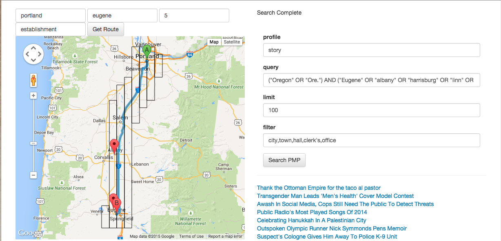

# Soundpath
Soundpath is a web application that provides road trip directions and creates a playlist of public media stories about the people and places along the route.    

The idea was first presented as part of a ["Hack the Future of Journalism"](http://www.rjionline.org/hackathon2014/soundpath-final-presentation) hackathon at KQED in San Francisco.

## This is a work in progress

**Here's a basic overview of what we're working on:**

1. Getting the route information. (DONE) 
2. Identifying places and points of interest along the path. (IN PROCESS)
    * First, we tried using city halls near the route to identify towns of interest.
    * Second, we added searches for establishments near the route; the challenge with this is that the names on the map don't always make a good search term for the PMP. For example, Google Maps includes "The Metropolitan Museum of Art," while public media stories (at least those from the region) almost all use "The Met" to describe the same institution. 
    * Third, I'm extracting address information from establishments as a way of getting locations. 
3. Searching the Public Media Platform for stories about those points of interest. (IN PROCESS)
    * Searching for ("State" OR "Abbr.") AND ("City1" OR "City2" OR "CityN") is providing acceptable results. Here's an example:
 
    * The PMP's content is limited, but here's what comes up:
       * PORTLAND | http://admin.pri.org/stories/2015-05-07/thank-ottoman-empire-taco-youre-eating
       * EUGENE | http://www.npr.org/2015/04/19/400826487/transgender-man-leads-mens-health-cover-model-contest?ft=nprml&f=400826487
       * LINN, ORE. | http://www.npr.org/2015/02/23/388449799/awash-in-social-media-cops-still-need-the-public-to-detect-threats?ft=nprml&f=388449799
       * PORTLAND | http://www.npr.org/2014/12/05/368564417/public-radios-most-played-songs-of-2014?ft=nprml&f=368564417
       * PORTLAND | http://www.npr.org/sections/parallels/2014/12/21/371247599/celebrating-hanukkah-in-a-palestinian-city?ft=nprml&f=371247599
       * EUGENE, ORE. | http://hereandnow.wbur.org/2014/11/18/nick-symmonds-memoir
       * ALBANY | http://www.npr.org/2014/09/30/352661287/cologne-gives-suspect-away-to-police-k-9-unit?ft=3&f=352661287

4.  Building a playlist from PMP content that matches location to story and takes the right amount of time. (TBD)

**In the future we'd like to:**

1. Allow users to save and edit playlists
2. Improve matching between place and audio piece.
    * Better geographic information about stories in the PMP would let us expand use from road trip–scale distances to daily commuters and urban tourists. 
    * Better matching of stories so that results are actually about a place, rather than stories that mention a place in passing (e.g., the location of the station, a tour stop mentioned by an artist in an interview, etc.)
    * Add information to existing stories using text analysis? (Currently, I'm researching various methods of identify place names in text. Thankfully, geographers have been nerding out about this lately, so there's some good stuff out there. Whether it's useful for our purposes or not remains to be seen.)

